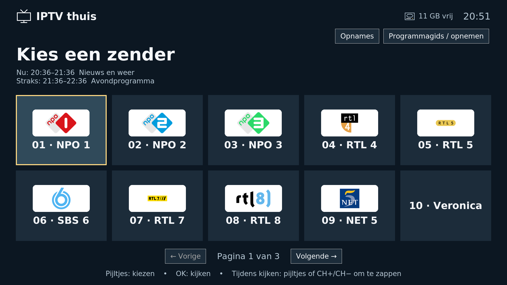
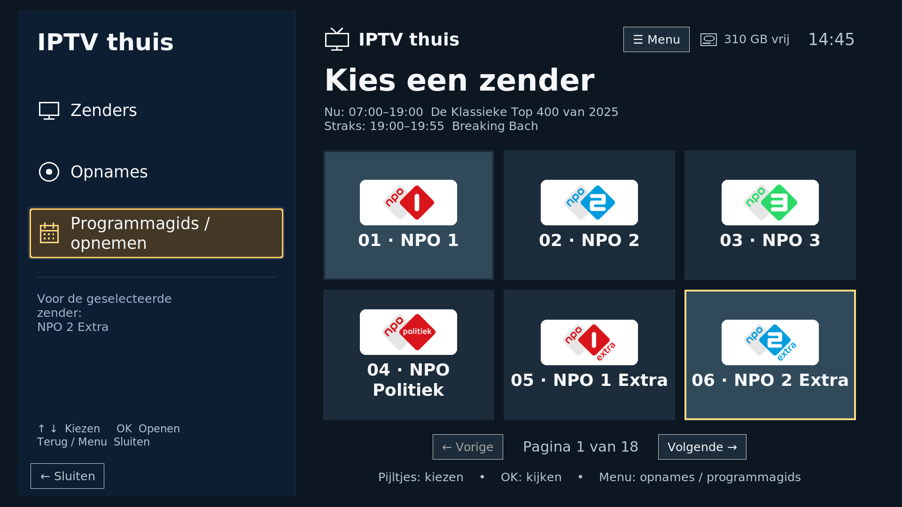
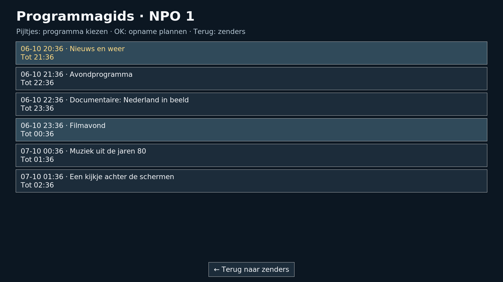
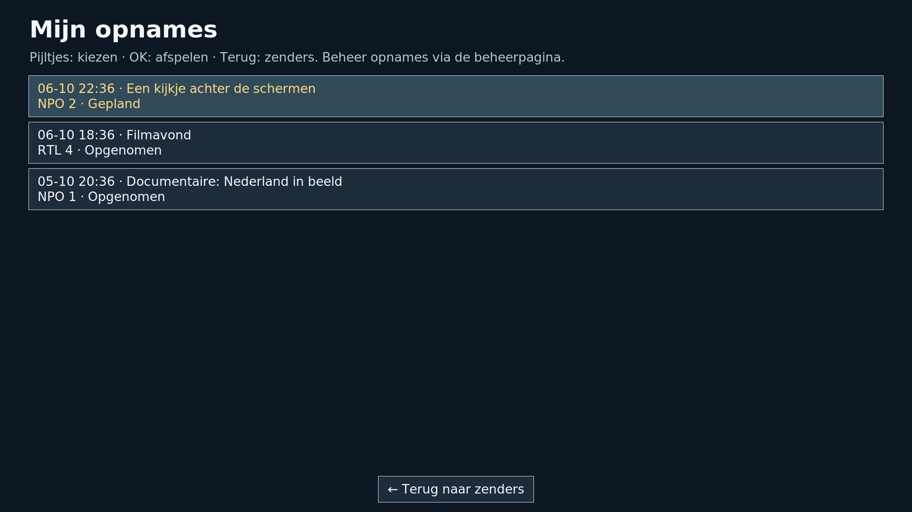
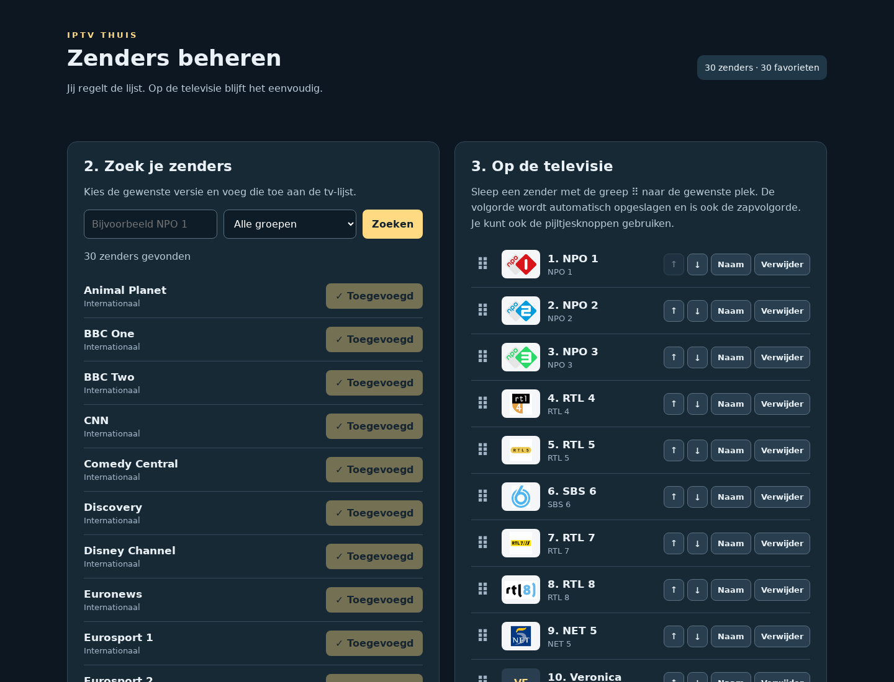
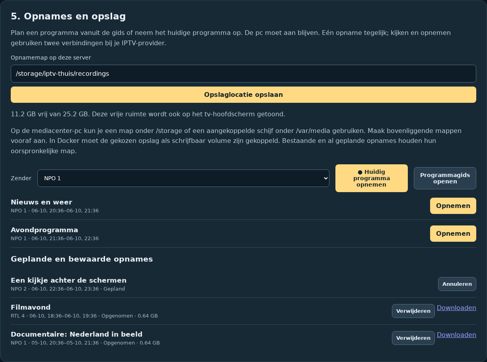

# IPTV thuis

Een zelfstandige Linux-tv-app met grote zenderknoppen en een aparte webbeheerpagina. Ontworpen voor iemand die alleen wil kiezen, kijken en zappen, zonder Kodi-menu's.

De app draait zelfstandig met Tk en mpv onder X11. Voor Debian/Ubuntu is een Linux-installatiescript beschikbaar; voor LibreELEC Generic x86_64 is er een aparte [tv-container met Xorg en mpv](deploy/libreelec/README.md). De LibreELEC-versie is getest met HDMI-beeld en -geluid, een USB-afstandsbediening, EPG en opnames. De reguliere Docker-container biedt webbeheer en een browserpreview; live afspelen gebeurt in de zelfstandige tv-app.

## Screenshots

De screenshots tonen de echte interface met voorbeeldzenders, programma's en opnames. De beschikbare logo's komen uit de zenderlijst; bij ontbrekende logo's blijft de zendernaam zichtbaar. Er staan geen provider-inloggegevens of persoonlijke beheerinstellingen in beeld.

### Televisie

Grote favorietenknoppen, de huidige en volgende uitzending en de vrije ruimte op de ingestelde opnameschijf.



### Zijmenu

Open met Menu vanuit elke zender. Het zijmenu heeft pictogrammen en een afgeronde, goudgele selectie voor Zenders, Opnames en Programmagids / opnemen. Terug sluit het menu en bewaart de geselecteerde zender.



### Programmagids en opnemen

Kies een programma met de pijltjes en druk op OK om de opname te plannen.



### Opnames terugkijken

Een eenvoudig overzicht van geplande en opgenomen programma's.



### Zenders beheren

Zoek zenders, pas namen aan en sleep favorieten naar de gewenste volgorde.



### Opnames en opslag beheren

Stel de opnamemap in, plan via de EPG en beheer bewaarde opnames.



## Functies

- Maximaal tien grote favorieten per pagina; meer pagina's verschijnen automatisch.
- EPG met huidige en volgende uitzending, plus een programmagids om opnames te plannen.
- Opnames terugkijken op de tv; opslaglocatie, planning en bestanden beheren via de webpagina.
- Vrije ruimte van de ingestelde opnameschijf zichtbaar op het hoofdscherm.
- Streams spelen met mpv binnen hetzelfde venster.
- Pijltjes of CH+/CH− zappen direct door de favorieten tijdens de uitzending. Na de laatste volgt de eerste.
- Terug opent de zenderlijst. OK tijdens het kijken toont kort de zendernaam en de huidige en volgende uitzending.
- Webbeheer op `http://IP-VAN-TV-PC:8080/admin`: Losse Xtream Codes-inloggegevens gebruiken, M3U uploaden of via een adres ophalen, zoeken, groepen filteren, favorieten toevoegen, verwijderen, hernoemen en ordenen door te slepen, eigen stream toevoegen.
- Een opgeslagen M3U-adres wordt elke zes uur vernieuwd zolang de app draait. De app controleert elke minuut of verversen nodig is; bij een fout probeert hij het na vijftien minuten opnieuw. Bij starten wordt alleen opnieuw opgehaald als de laatst geslaagde import minstens zes uur oud is. Een bestandsupload vervang je door opnieuw te uploaden.
- Eigen namen en volgorde blijven bewaard bij import. Verdwenen zenders blijven als niet beschikbaar zichtbaar en worden bij zappen overgeslagen.
- Standaard uitgebreide M3U-lijsten met `#EXTINF`, HTTP(S), RTSP, RTMP en UDP. Kodi-stijl HTTP-headers na `|` worden doorgegeven aan mpv. DRM, aanbieder-specifieke loginflows, en catch-up zijn niet geïmplementeerd.

## Installatie op de tv-pc

### Lokaal testen met Docker

```sh
docker compose up -d --build --wait
docker compose exec app cat /data/first-login.txt
```

Open `http://IP-VAN-DOCKER-HOST:8090/admin` en log in als `admin` met het wachtwoord uit de tweede opdracht. Vul je serveradres, IPTV-gebruikersnaam en IPTV-wachtwoord in en klik op **Inloggen en zenders ophalen**, of importeer je M3U. Voeg favorieten toe en open `http://IP-VAN-DOCKER-HOST:8090/tv` om de zenderknoppen, pagina's en direct zappen te testen. Deze browser-preview gebruikt je echte favorieten en haalt wijzigingen elke vijf seconden op, maar speelt **geen live video** af. Echte mpv-weergave blijft onderdeel van de Linux-desktop-app.

De container draait zonder root, met een alleen-lezen app en een blijvend Docker-volume voor de database en beheerconfiguratie. Herstarten of opnieuw bouwen bewaart je gegevens. `docker compose down` stopt de app; voeg geen `--volumes` toe als je de gegevens wilt bewaren. Wijzig de poort desgewenst met `IPTV_PORT=8091 docker compose up -d`. Alleen op de Docker-host bereikbaar maken kan met `IPTV_BIND_ADDRESS=127.0.0.1 docker compose up -d`.

Een Docker-beheerwachtwoord wijzigen: `docker compose stop app`, daarna `docker compose run --rm --service-ports app python -m mijntv --admin-only --data-dir /data --reset-password`. Stop deze tijdelijke instantie na de wijziging met Ctrl+C en start de normale instantie weer met `docker compose up -d`.

### Zelfstandige tv-app

Gebruik Debian/Ubuntu met een lichte desktop, bijvoorbeeld XFCE, en een **X11/Xorg-sessie**. De speler wordt ingebed met een X11-venster-ID; native Wayland is niet het ondersteunde pad. Zie de [mpv-documentatie](https://mpv.io/manual/stable/#options-wid).

```sh
git clone <URL-VAN-JE-REPOSITORY>
cd IPTV-thuis
sh tools/install-linux.sh
~/.local/bin/iptv-thuis
```

Het script installeert `python3-tk`, `mpv` en lettertypen met sudo, kopieert de app naar de gebruikersmap en maakt een desktop-autostart-item. Voer het uit als de tv-gebruiker. Stel **automatisch aanmelden** voor die gebruiker in via de desktopinstellingen. Schakel daar ook schermvergrendeling en automatisch slapen uit. Daarna opent de app bij het aanmelden op volledig scherm het zenderoverzicht. De app verandert geen aanmeldinstellingen of schijven.

Handmatig starten zonder installatiescript:

```sh
sudo apt-get install python3 python3-tk python3-pil python3-pil.imagetk mpv fonts-dejavu-core
python3 -m mijntv
```

Bij de eerste start toont het lege overzicht het beheeradres, gebruikersnaam `admin` en het gegenereerde wachtwoord. Open dit adres op een laptop of telefoon op hetzelfde netwerk. Importeer de M3U en kies ongeveer 30 favorieten. Binnen vijf seconden verschijnen ze op de televisie. Alleen de gekozen favorieten verschijnen op het tv-scherm. In het zelfstandige tv-scherm, het webbeheer en de browser-preview tonen favorieten de echte `tvg-logo`-afbeeldingen uit de playlist. De server haalt ze op en bewaart ze lokaal; het browseradres bevat geen provider-inloggegevens. Bij ontbrekende of onbereikbare logo’s blijven naam en een eenvoudige tekstmarkering zichtbaar.

Het tv-scherm toont rechtsboven een schijficoon met de vrije ruimte van de ingestelde opnamemap. Op LibreELEC is de standaardmap `/storage/iptv-thuis/recordings`. De waarde wordt elke dertig seconden vernieuwd en weergegeven in GB (1 GB = 1 miljard bytes). Zie [Opnemen met de programmagids](#opnemen-met-de-programmagids) voor opslagkeuze en opnamebediening.

## Afstandsbediening

| Knop/toets | Zenderoverzicht | Tijdens kijken |
| --- | --- | --- |
| Pijltjes | Zender kiezen | Volgende/vorige favoriet |
| OK / Enter / spatie | Zender starten | Zendernaam tonen |
| CH+ / PageDown | Volgende pagina | Vorige favoriet |
| CH− / PageUp | Vorige pagina | Volgende favoriet |
| Terug / Escape / Backspace | In overzicht blijven | Stoppen en zenderlijst openen |
| F11 | Volledig scherm wisselen | Volledig scherm wisselen |
| Ctrl+Q | App afsluiten | App afsluiten |

Een USB 2,4GHz-ontvanger die zich als toetsenbord presenteert kan deze toetsen rechtstreeks sturen. CH-knoppen kunnen andere codes sturen; controleer ze op de tv-pc met bijvoorbeeld `xev` en pas indien nodig `TV.key` in `mijntv/tv.py` aan. Volume + en − (XF86AudioRaiseVolume/XF86AudioLowerVolume) wijzigen het spelervolume met 5%, met een korte melding in beeld. De instelling blijft bewaard bij zappen en herstart. De mute-knop schakelt het geluid uit of aan; volume aanpassen heft mute op. Het volume van de tv zelf blijft apart instelbaar.

## Beheer en gegevens

De beheerbackend gebruikt alleen de Python-standaardbibliotheek. De tv-interface gebruikt Tk en Pillow voor zenderlogo’s; het Linux-installatiescript en de LibreELEC-tv-container installeren die onderdelen. Standaard staat alle configuratie in `~/.local/share/iptv-thuis/`, buiten de repository:

- `mijntv.db`: zenders, streamadressen, favorieten en het opgeslagen M3U-adres.
- `admin.json`: gezouten PBKDF2-hash van het beheerwachtwoord.
- `first-login.txt`: eerste wachtwoord om na een onbeheerde herstart te kunnen inloggen. Bewaar het in je wachtwoordmanager en verwijder dit bestand daarna desgewenst. De app toont dit wachtwoord alleen zolang er geen favorieten zijn.

Nieuwe gegevensbestanden zijn alleen toegankelijk voor de eigen gebruiker. Provideradressen worden niet teruggestuurd in catalogus/favorieten-API's, niet gelogd en niet in mpv-procesargumenten gezet. Een databaseback-up bevat wel providergegevens. Het beheer gebruikt HTTP Basic-authenticatie en bescherming tegen aanvragen vanuit andere websites. De ingebouwde HTTP-server is bedoeld voor het eigen LAN; gebruik HTTPS via een reverse proxy als je versleuteld beheer nodig hebt.

Wachtwoord wijzigen (sluit de app eerst met Ctrl+Q):

```sh
~/.local/bin/iptv-thuis --reset-password
```

Alleen webbeheer draaien, bijvoorbeeld voor ontwikkeling zonder beeldscherm:

```sh
python3 -m mijntv --admin-only --host 127.0.0.1 --port 8080 --data-dir ./data
```

Dit wijzigt uitsluitend de gegevensmap van die instantie. De normale installatie draait beheer en televisie samen op de tv-pc met dezelfde database.

## IPTV met losse inloggegevens

Het webbeheer heeft drie velden voor **Serveradres**, **IPTV-gebruikersnaam** en **IPTV-wachtwoord**. Ze worden gebruikt om het standaard Xtream Codes-adres `/get.php` met `type=m3u_plus` en `output=ts` op te vragen. Je hoeft zelf geen M3U-URL te maken. Speciale tekens in de inloggegevens worden correct gecodeerd. Zie de [playlistdocumentatie](https://github.com/worldofiptvcom/xtream-codes-api/blob/master/docs/utilities/playlists.md).

De provider moet deze Xtream Codes-playlistmethode ondersteunen. De velden worden niet vanuit de opgeslagen configuratie teruggevuld en het wachtwoord wordt na versturen uit het formulier gewist. Het samengestelde adres wordt in de lokale database bewaard voor automatisch vernieuwen; een mislukte aanvraag laat de bestaande zenderlijst intact.

## HDMI-geluid op LibreELEC

De tv-container kiest automatisch het HDMI-audioapparaat waaraan ALSA de aangesloten televisie koppelt. Het nummer van de beeldconnector of een ELD-bestand hoeft niet gelijk te zijn aan het audiodevicenummer. De uitvoer gebruikt stereo PCM. Een handmatige keuze blijft mogelijk via `IPTV_AUDIO_DEVICE`, bijvoorbeeld `alsa/hdmi:CARD=HDMI,DEV=0`, bij het aanmaken van de container.

## Beeldinstellingen

In het webbeheer onder **Beeldinstellingen** kies je automatisch, 720p, 1080p of 4K UHD (3840×2160). De zelfstandige X11-app biedt alleen resoluties aan die het aangesloten scherm meldt. De verversingssnelheid wordt door Xorg gekozen; op de AOpen DE7200 is 4K via deze HDMI-aansluiting maximaal 30 Hz. Opslaan stopt een lopende uitzending en heropent het zenderoverzicht binnen enkele seconden. De keuze blijft bewaard na herstart. Een opname van het geteste [4K-scherm](docs/tv-4k.png) staat in de documentatie. Als een ander scherm de ingestelde resolutie niet ondersteunt, blijft het huidige beeld behouden.

Met **Beeldmarge** (0–10% aan elke rand) plaats je de hele interface en video verder van de tv-randen. Dit helpt bij overscan. De tv-instelling voor volledig beeld, vaak ‘Just Scan’, ‘Screen Fit’ of ‘1:1’, kan de afgesneden randen ook verhelpen. De Docker-browserpreview verandert geen HDMI-resolutie: instellingen daar gelden voor een zelfstandige app die dezelfde gegevensmap gebruikt. Voor LibreELEC stel je dit in op de beheerpagina van de mediacenter-pc zelf.

## Programmagids (EPG)

Bij Xtream Codes-inloggegevens haalt de app automatisch de XMLTV-gids van de aanbieder op, bij de eerste start en daarna elke vier uur. In het zenderoverzicht zie je **Nu** en **Straks** voor de geselecteerde zender. Tijdens kijken verschijnt dezelfde informatie bij zappen of een druk op OK. De tijden volgen de lokale tijdzone van de tv-pc.

Via **Programmagids vernieuwen** in het webbeheer kun je direct opnieuw ophalen. Alleen programma’s van de favorieten worden lokaal opgeslagen; koppeling gebeurt op de `tvg-id` uit de playlist, zodat hernoemen blijft werken. Wijzigingen in de favorieten worden automatisch meegenomen. Ontbrekende programmagegevens worden aangegeven zonder het afspelen te blokkeren. Bij een mislukte download blijft de vorige gids bewaard. XMLTV en gecomprimeerde XMLTV worden ondersteund, met een limiet van 512 MB na uitpakken. De app gebruikt de opgeslagen providergegevens; er zijn geen extra inlogvelden nodig.

## Importgedrag

Zenderidentiteit wordt afgeleid van `tvg-id`, oorspronkelijke naam, groep en het volgnummer bij exacte duplicaten. Tijdelijke streamtokens tellen niet mee: een vernieuwde URL vervangt de bestaande favoriet. Als de aanbieder naam, groep of ID verandert, voeg je de nieuwe zender opnieuw toe en verwijder je de oude favoriet. Exact gelijk benoemde duplicaten worden op volgorde gekoppeld; onderscheidende namen/IDs zijn betrouwbaarder.

Playlists mogen maximaal **512 MB** zijn, zowel via een download als een bestandsupload. Downloads en uploads worden in blokken naar een tijdelijk bestand in de gegevensmap geschreven en vervolgens regel voor regel in SQLite verwerkt. De volledige playlist en zendercatalogus worden niet tegelijk in het geheugen geladen. Het tijdelijke bestand wordt ook bij fouten opgeruimd; zorg dat de gegevensmap voldoende vrije schijfruimte heeft voor de playlist en database.

Een ongeldige, onderbroken of mislukte import laat de oude lijst intact. Bij starten worden achtergelaten tijdelijke importtabellen op de achtergrond opgeruimd voordat een nieuwe automatische import begint. De import houdt één schrijvende databaseverbinding open, met 32 MB SQLite-cache en commits per duizend zenders. De unieke zender-ID-index wordt na het inlezen in één keer opgebouwd. Dit beperkt willekeurige schijfbewerkingen en voorkomt herhaalde WAL-checkpoints bij het sluiten van elke batch op een mechanische schijf. Alleen de vervangbare import en opruiming gebruiken SQLite `synchronous=NORMAL`; bewerkingen van favorieten behouden de standaard synchronisatie. De nieuwe catalogus wordt in een aparte tabel opgebouwd met korte transacties per duizend zenders. Favorieten blijven daardoor tijdens grote imports te bewerken. Pas na volledige verwerking wordt de catalogus in één transactie omgewisseld. Zoekresultaten worden per honderd opgehaald, zodat de beheerpagina niet alle zenders tegelijk hoeft te tekenen. Handmatige streams blijven bij import bestaan.

## Ontwikkelen en testen

```sh
python3 -m unittest discover -s tests -v
python3 -m compileall -q mijntv tools tests
sh -n tools/install-linux.sh
python3 tools/build.py
```

De optionele videoproef vereist X11 (of Xvfb), tkinter, mpv en ffmpeg; zonder die omgeving wordt alleen die proef overgeslagen. Een afbeelding van het geteste tv-scherm staat in `docs/tv-scherm.png`.

Het bouwscript maakt `dist/IPTV-thuis-0.1.0.zip` met bronbestanden, documentatie, tests en de klikbare mockup. `index.html` is die mockup, geen browser-speler van de echte M3U. Hij ondersteunt ook direct zappen op het voorbeeldscherm.

Controleer voor dagelijks gebruik op de tv-pc: koude boot, HDMI-geluid, vijf echte streams, herhaald zappen, Terug, alle afstandsbedieningsknoppen, netwerkverlies en herstel, en beheer vanaf een tweede apparaat.

## Project delen

Gebruik de broncode uit Git of het archief uit `python3 tools/build.py`. Het archief bevat uitsluitend de door Git bijgehouden projectbestanden, zonder `.git`, lokale instellingen of Git-remotes. Lokale databases, playlists, beheerwachtwoorden en SSH-sleutels worden uitgesloten met `.gitignore`. De tests gebruiken fictieve inloggegevens en voorbeeldadressen. De screenshots tonen alleen de interface en zenderlogo’s.

De Docker-volumes en de gegevensmap van de tv-pc bevatten wel de echte providergegevens en beheerconfiguratie; deel die niet mee als broncode. `.gitignore` verwijdert niets dat eerder gecommit is, en beschermt niet tegen geheimen die je in een bronbestand schrijft. De Git-geschiedenis kan nog een oud lokaal repository-adres bevatten. Het bronarchief bevat die geschiedenis niet.


## Opnemen met de programmagids

Open op de **mediacenter-pc** `/admin`, onderdeel **5. Opnames en opslag**. De standaardmap op LibreELEC is `/storage/iptv-thuis/recordings`. Je kunt een andere schrijfbare map onder `/storage` of op een aangekoppelde schijf onder `/var/media/<schijf>` kiezen. De bovenliggende map moet bestaan. Een NAS kan ook worden gebruikt wanneer deze vooraf op de host is aangekoppeld en in de container beschikbaar is. De app koppelt geen netwerkschijven aan. Een verdwenen externe schijf geeft een fout; de app schrijft dan niet naar het achtergebleven lege aankoppelpunt.

Het schijficoon op de tv en de browserpreview toont de vrije ruimte van de ingestelde opnamemap. Een gewijzigde locatie geldt voor nieuwe opnames: bestaande bestanden en reeds geplande opnames houden hun oorspronkelijke map. Er wordt niets automatisch verplaatst. De Docker-testserver heeft zijn eigen opslag en instellingen. Standaard gebruikt deze `/data/recordings` in het bestaande gegevensvolume. Voor een andere Docker-opslag voeg je een schrijfbare bind mount toe aan `compose.yaml`, bijvoorbeeld `- /srv/tv-recordings:/recordings`; geef UID 10001 schrijfrechten en stel `/recordings` in via beheer.

Kies in het beheer een favoriete zender en open de programmagids. **Opnemen** plant precies de begin- en eindtijd van het EPG-programma. Bij een lopend programma wordt alleen het resterende deel opgenomen; er is geen terugkijkbuffer. **Huidig programma opnemen** gebruikt de eindtijd uit de EPG, of neemt één uur op wanneer programmagegevens ontbreken. Eén opname tegelijk: overlappende plannen worden geweigerd. De pc moet aan blijven. Geplande opnames blijven in SQLite bewaard, starten ook na een herstart wanneer het programma nog loopt, en krijgen een foutstatus wanneer het volledige tijdvak is gemist. Een tijdens herstart actieve opname krijgt de status Onderbroken; het gedeeltelijke bestand blijft bewaard, maar wordt niet automatisch hervat.

Op de tv: druk vanuit elke zender op **Menu** (of F2/O) om het zijmenu te openen. In de zenderlijst opent **links** vanuit de eerste kolom ook het menu. Kies **Zenders**, **Opnames** of **Programmagids / opnemen** met omhoog/omlaag en druk OK. De programmagids hoort bij de geselecteerde zender, ook als die op de onderste rij staat. **Terug** of opnieuw **Menu** sluit het menu en bewaart je zender en pagina; tijdens afspelen blijft de video doorlopen zolang je alleen het menu opent. In de gids plant OK het geselecteerde programma. In Opnames speelt OK het geselecteerde beschikbare bestand af. Tijdens terugkijken: OK pauzeert, links/rechts springen 30 seconden en Terug opent de opnamelijst. Een afstandsbediening met een herkende opnameknop (`XF86Record`) neemt het huidige programma op; R doet hetzelfde. De knoppen zijn ook met de muis aanklikbaar. Via beheer kun je plannen annuleren, lopende opnames stoppen, bestanden downloaden en oude opnames definitief verwijderen.

De recorder gebruikt FFmpeg met `-c copy`: video en audio worden zonder hercodering in een `.ts`-bestand opgeslagen, met een lage CPU-belasting. De planner stopt op de EPG-eindtijd en controleert elke twee seconden de opslag. Bij minder dan 512 MiB vrije ruimte stopt de opname met een foutstatus; gedeeltelijke bestanden blijven beschikbaar. Providerstoringen of een vroegtijdig gesloten stream worden als mislukt gemeld; deze versie herverbindt niet automatisch. HTTP(S)-streams worden ondersteund; streams met aanvullende M3U-headeropties nog niet. Kijken en opnemen gebruiken aparte providerverbindingen, ook op dezelfde zender: je abonnement moet dit toestaan. EPG-tijden komen van je provider en kunnen afwijken van de uitzending.

Streamadressen staan niet in opname-API-antwoorden, logs of FFmpeg-procesargumenten. FFmpeg leest het adres uit een tijdelijk manifest met rechten 0600, dat na afloop wordt verwijderd. Deel geen gegevensvolume of opnames wanneer je alleen de broncode wilt delen. Bronarchieven bevatten uitsluitend door Git gevolgde projectbestanden.

## Streambewaking en diagnose

Live tv wordt iedere twee seconden gecontroleerd op afspeelvoortgang, langdurige buffering en een geselecteerd audiospoor zonder actieve audio-uitvoer. De eerste vijftig seconden krijgen ruimte om te laden; daarna leidt twintig seconden zonder voortgang tot een herstelpoging. Bij een afgebroken stream wordt eveneens opnieuw verbonden. Er zijn drie tot maximaal acht herstelpogingen per tien minuten, afhankelijk van het aantal gekoppelde bronnen, minstens zestig seconden uit elkaar. Terug of een andere zender annuleert een uitgestelde poging. Opnames worden niet automatisch opnieuw gestart.

In de gegevensmap staat `stream-diagnostics.log`: elke vijftien seconden spelerstatus, foutcategorieën, herstelpogingen en begin/einde van automatische zenderlijstupdates. Het log bevat geen streamadressen, headers of ruwe providerfoutmeldingen. Er blijven maximaal drie bestanden van ongeveer 1 MB bewaard. Deze metingen helpen bij diagnose, maar een oplopende afspeeltijd bewijst op zichzelf niet dat het tv-scherm beeld toont of hoorbaar geluid geeft.

## Automatisch wisselen tussen zenderbronnen

Elke favoriete zender is één item. Bronnen met dezelfde niet-lege programmagids-ID (`tvg-id`) uit andere groepen worden automatisch gekoppeld. Een toegevoegde versie van dezelfde zender wordt een voorkeursbackup. Bestaande dubbelen worden samengevoegd met behoud van de eerste naam en positie. Expliciet toegevoegde backups uit dezelfde groep blijven ook bruikbaar; identieke streamadressen worden maar één keer geprobeerd. Zenders zonder programmagids-ID en handmatige streams worden niet op naam samengevoegd.

Bij een fout, vastloper of ontbrekende audio-uitvoer probeert de tv de volgende bron, terwijl naam, favoriet en programmagids gelijk blijven. De bronadressen worden bij het vernieuwen van de lijst opnieuw opgezocht. Als de oorspronkelijke bron ontbreekt, blijven backups met de opgeslagen programmagids-ID beschikbaar. Webbeheer toont het aantal bronnen. Herstel is begrensd tot maximaal acht pogingen per tien minuten bij meerdere bronnen; het bestaande minimum van drie pogingen blijft gelden. Opnames worden niet automatisch naar andere bronnen overgeschakeld.

Een bron die bij opeenvolgende metingen gezonde afspeelvoortgang en audio-uitvoer toont, wordt opgeslagen als voorkeur voor die favoriet. Die bron wordt bij opnieuw openen en na een herstart als eerste gebruikt. Ontbreekt de bron in een vernieuwde zenderlijst, dan blijven de overige bronnen beschikbaar.

Live tv controleert iedere tien seconden een gedecodeerd videoframe met Pillow (`python3-pil`, al aanwezig in de LibreELEC-container). Circa 45 seconden vrijwel volledig zwart beeld leidt tot automatische bronwisseling, ook als audio en afspeeltijd doorgaan. Korte zwarte overgangen en donkere scènes met zichtbare details tellen niet mee; pauzeren en opnames zijn uitgezonderd. De kleine meting bevat alleen een ja/nee-resultaat en tijdstip; het tijdelijke frame wordt direct verwijderd. Een bron wordt pas als voorkeur opgeslagen na minimaal 30 seconden gezonde metingen met zichtbaar beeld. Een als zwart herkende voorkeursbron wordt verwijderd. Zonder bruikbare beeldmeting wordt geen nieuwe voorkeur opgeslagen. Deze controle herkent geen foutmelding die de provider als zichtbaar videobeeld uitzendt.

Bij snel achter elkaar zappen verandert de geselecteerde zender direct. Pas na 350 ms zonder nieuwe zapdruk wordt de laatst gekozen stream geladen. Het opstarten van mpv gebeurt op de achtergrond, zodat de bediening tijdens het verbinden beschikbaar blijft. Tussentijdse zenders worden niet gestart en oude laadtimeouts worden bij een nieuwe keuze ingetrokken.
